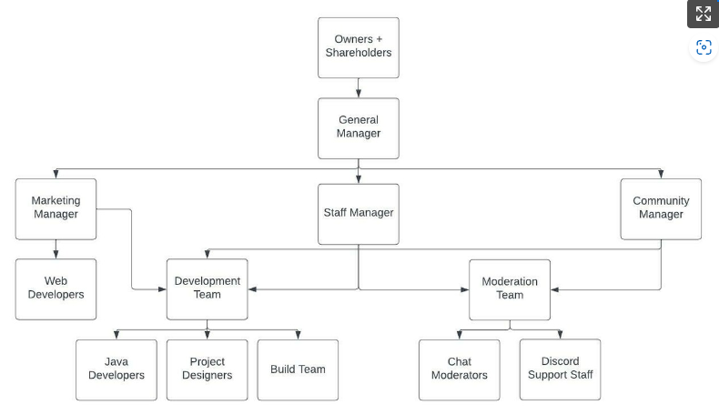

# Ranks
> This page aims to provide a comprehensive guide to the rank and ranking up system for the Minecraft server, including the staff hierarchy structure and the in-game ranks available to all players.
   
## Overview

Having a well-designed ranking system is crucial to maintaining a healthy and active community on any Minecraft server. Careful consideration must be given to both staff and non-staff positions to ensure the server performs well and maintains a positive public image. Neglecting this aspect can cause a server to perform poorly or develop a negative reputation that could have long-lasting negative effects.

Historically, many servers, including AirshipCraft and other similar Minecraft servers, have struggled with staff abuse, poorly managed responsibilities and power, as well as schisms and corruption stemming from factionalism caused by undisciplined staff. To avoid these issues, it is important to establish a well-structured staff hierarchy with clear responsibilities and expectations.

In addition, a well-designed non-staff rank system that promotes social mobility and player engagement is also crucial. This can be seen in prison servers where players work towards a rank-up and in servers such as StarQuest that offer multiple obtainable ranks and rank prefixes that players can work towards simply by playing the server normally. StarQuest also employed a unique system of promoting multiple play styles through entire rank "trees" that allowed players to move up in certain paths if their play style better reflected that "career" choice.

## Staff Hierarchy

To staff the server, it is important to maintain an appropriate staff to player ratio to ensure players do not feel overwhelmed or intimidated. It is also important to differentiate between players who are dedicated to the server and those who are solely interested in acquiring power. To achieve this, staff member assignments will not be publicized to limit corruption and factionalism within the community.

Responsibilities and divisions of labor will be assigned behind the scenes to ensure each staff member is hand-picked for their unique skills and expertise. In theory, staff members will be able to perform each other's job, but each will have their own specialization to ensure maximum efficiency and effectiveness.

### Division of Power

Here is a chart that illustrates the separation of powers and responsibilities among our staff team. While there may be many different roles and responsibilities among our staff, we have simplified the public-facing view to include only a few key positions such as "Owner," "Admin," or "Mod." This makes it easier for members of our community to know where to direct their questions, comments, or concerns, rather than feeling lost in a sea of staff members who may not be able to address their specific issues. 
   
By having clear divisions of responsibility, we can ensure that our staff are equipped to handle a wide range of issues that may arise in our community. This helps prevent important issues from falling through the cracks and ensures that we are able to address community concerns in a timely and effective manner.
   

## Non-staff, Player Ranks

A paper published in the journal "*Cyberpsychology, Behavior, and Social Networking*" argues that "status-based incentives" such as rank and privilege are important for fostering engagement and social interaction in online communities. The authors note that "status can act as a reward for social behavior, and can enhance the sense of social connectedness among users.
   
In a study published in the journal "*Computers in Human Behavior*", researchers found that well-designed ranking systems can help promote participation and engagement in online communities. The study noted that "users appear to enjoy progressing through the ranks, which motivates continued participation and contributes to the sense of social connectedness."
   
For this very reason, we aim to introduce a plethora of attainable ranks available to all players that are awarded solely on merit. 