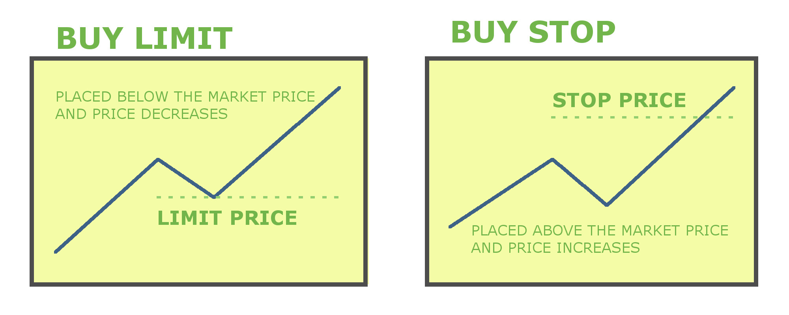
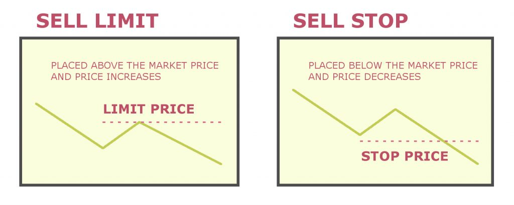

> <span style="color:red">Currently unimplemented.</span>
# Companies
> See also [Commands](/src/mech/economy/companies/commands.md) for a full list of commands.

## Overview

Companies are registerable entities that players can create, join, and manage. Companies allow players to enable profit-sharing between company owned stores as well as allowing other players, both inside and outside the company, to buy and sell stock in the company.
   
Players can only create or join one company at any time and can sell ownership of their company or transfer it to other players. CEOs (company owners) can invite other players to join their company. 
   
If a player is already in a company and receives an invitation to join another company and that player accepts the invite, they will leave whatever company they are currently in and join the new company. If the invited player happens to be a CEO of a company then they will be prompted to either first transfer ownership or disband their company.
   
By introducing the concept of companies in our economy system, we can create a more diverse and dynamic in-game economy. Players can invest in companies and share in their profits, while companies can expand their reach and profitability by owning and operating in-game shops. We believe this mechanic will add a new level of depth and engagement to our server.

## Registering a Company

To register a company, a player must have a certain amount of money in their account. We can set a minimum amount required to register a company, such as 100,000 in-game currency. Once the player has the required amount, they can run the following command to register a company:

```
/company register [company name] [ticker symbol] [optional: # of shares]
```

This command will create a new company with the specified name and ticker symbol and set the player as the owner, or CEO. The company's information will be stored in a separate database table from the player's information.
   
Notice the optional third argument which is the amount of shares offered as an initial public offering (IPO). Players can set whatever amount of shares they would like but the default value will always be 100,000.
   
In-order to maintain a company, a daily upkeep of `100 x 0.75(amount of members)` will be withdrawn out of the company's bank. To check the balance of the company, you can do the following command:

```
/company bank
```

A company must also be registered to a physical location on the map. The physical location of the company is that company's [HQ](/src/mech/nodes/nations/plots.md) and it will determine the income tax rate come payday. CEOs must either purchase a plot from a nation or be given a plot by a nation leader. 
   
You may also claim plots in the wilderness at a default cost. This allows for trade companies to be autonomous and to avoid paying income tax. Normal tax rates still apply to transactions done at any of the company owned markets. 
   
A company must also have a physical bank [vault](/src/mech/economy/banking.md).

> See: [Plots](/src/mech/nodes/nations/plots.md), [Objects](/src/mech/nodes/nations/objects.md), [Market](/src/mech/economy/market.md) and [Banking](/src/mech/economy/banking.md)

## Company Owned Shops and Profit Sharing

Once a company is registered, any shops registered to any of its members will automatically be registered to the company. 

Revenue generated by the shops will be then deposited into the corporation [`bank`](/src/mech/economy/banking.md). 
   
There will be a "payday" daily and a percentage (90% by default) of the total contents of the corporation bank will be distributed equally among the members of the corporation. The CEO of the company can configure this percentage by running the following command:
   
```
/company payout [percentage]
```
   
The CEO can also withdraw the balance of the corporation bank at any time by running this command:
   
```
/company withdraw [amount]
```
The plugin will also keep track of the highest money makers within the company which can be viewed by running the command:
```
/company top [company name]
```
This will show which member of the company is bringing in the most revenue through the shops registered to them.
   
In the event that a member of the company who has shops registered to them is removed from the company, their shops are then unregistered from the company as well.
## Stock Market

Companies have stock value that is determined by how well that company performs based on the following metrics:

1. Size of the company: the amount of shops registered to the company.
2. Daily revenue of the company: the total daily sum of the revenue made by the company through the buying and selling of goods via shops.
3. Amount of shares available for purchase: As with the real world stock market, supply and demand plays a big role in determining the price of a stock.
   
Each company by default starts with 100,000 shares available to be bought. Anyone can purchase these stocks including company members. The starting price of a stock is 
   
### Buying and Selling Stocks

#### ***Buying***
There are two ways for players to purchase stock in a company: `buy limit orders` and `buy stop orders`. 
    
Buy limit orders are located below current price meaning they are filled at a designated price or better. Buy limit orders are designed for precision.
   
Buy stop orders are located above current price meaning they are filled at the best available market price. Buy stop orders are intended to enter or exit the market immediately upon being elected.
   

   
Players can place buy stop orders for stocks in registered companies using the following command:

```
/company buy [ticker symbol] [amount]
```
   
This command will purchase that amount of available shares at whatever asking price is available.
   
To place a limit buy order, you must use the following command:
    
```
/company limitbuy [ticker symbol] [amount] [limit price]
```
   
In this command we have the `limit price` which will set the target price for shares to be bought either at that price or lower  in-order to fill the limit buy order.
    

#### ***Selling***
Just like with buy orders, there are two ways to sell stock: `sell limit orders` and `sell stop orders`.
   
A sell limit is a pending order used to sell at the limit price or higher while a sell stop, which is also a pending order, is used to sell at the stop price or lower. 
   
Sell limit is used to guarantee a profit by selling above the market price and sell stop is used to minimize loss by selling at the stop price.


   
Players can place sell stop orders for stocks they own by executing the following command:
   
```
/company sell [ticker symbol] [amount]
```

The amount parameter is the number of stocks the player wants to sell. By putting "all" instead of a number will place an order to sell all owned shares at the highest available bid price. 

To place a limit sell order, you can use the following command:
   
```
/company limitsell [ticker symbol] [amount] [limit price]
```
   
Much like setting a buy limit order, the `limit price` parameter will set the asking price for the shares and will attempt to sell whatever specified amount of shares of a stock at that asking price or higher. 
   
### NPC Integration

## Technical Overview

To begin with, we'll need to create a new entity class called `Company`. This class will have attributes such as `name`, `owner`, `stockPrice`, `totalStock`, `sharesSold`, `shops`, and `profits`. The `shops` attribute will be a list of all the shops owned by the company, and the `profits` attribute will be a map that associates each shop with its current profit.

```java
public class Company {
    private String name;
    private UUID owner;
    private double stockPrice;
    private int totalStock;
    private int sharesSold;
    private List<Shop> shops;
    private Map<Shop, Double> profits;
    
    // constructor, getters, and setters
}
```

Next, we'll need to create methods for registering a new company, purchasing stock in a company, and sharing profits from company-owned shops. 

```java
public class CompanyManager {
    private List<Company> companies = new ArrayList<>();

    public void registerCompany(String name, UUID owner, double stockPrice, int totalStock) {
        Company company = new Company(name, owner, stockPrice, totalStock, new ArrayList<>(), new HashMap<>());
        companies.add(company);
    }
    
    public void purchaseStock(Player player, Company company, int numShares) {
        double cost = numShares * company.getStockPrice();
        if (player.getBalance() >= cost && company.getSharesSold() + numShares <= company.getTotalStock()) {
            player.withdraw(cost);
            company.setSharesSold(company.getSharesSold() + numShares);
            double ownership = numShares / (double) company.getTotalStock();
            company.getOwners().put(player.getUniqueId(), ownership);
        }
    }
    
    public void shareProfits() {
        for (Company company : companies) {
            for (Shop shop : company.getShops()) {
                double revenue = shop.getRevenue();
                double profit = revenue - shop.getCost();
                company.getProfits().put(shop, profit);
            }
            double totalProfit = company.getProfits().values().stream().mapToDouble(Double::doubleValue).sum();
            for (Map.Entry<UUID, Double> entry : company.getOwners().entrySet()) {
                Player player = Bukkit.getPlayer(entry.getKey());
                if (player != null) {
                    double share = entry.getValue() * totalProfit;
                    player.deposit(share);
                }
            }
        }
    }
}
```

Finally, we'll need to hook into the main [market](/src/mech/economy/market.md) plugin to make sure that company-owned shops are treated the same way as player-made shops. We can do this by adding a listener that listens for when a shop is created, and then adding that shop to the corresponding company's `shops` list.

```java
public class ShopListener implements Listener {
    private EconomySystem economySystem;

    public ShopListener(EconomySystem economySystem) {
        this.economySystem = economySystem;
    }

    @EventHandler
    public void onShopCreate(ShopCreateEvent event) {
        Player player = event.getPlayer();
        Shop shop = event.getShop();
        for (Company company : economySystem.getCompanies()) {
            if (company.getOwner().equals(player.getUniqueId())) {
                company.getShops().add(shop);
            }
        }
    }
}
```


The design for the stock market looks good so far! Here are a few suggestions to add more details:

### Stock Value Calculation

The stock value of a company can be calculated using the following formula:

$$ \text{Stock Value} = \frac{\text{Weekly Revenue}}{\text{Size of the Company}} \times 1000 $$

The resulting stock value is multiplied by 1000 to make it a more manageable number. This formula takes into account both the size of the company (which can be an indication of its stability) and its weekly revenue (which can indicate its growth potential). The stock value can be updated on a daily or weekly basis.

### Market Order Types

In addition to the `buy stop` and `buy limit` orders, we can also provide other order types to give players more control over their trades:

- `sell limit`: This order type allows players to sell their shares at a designated price or better.
- `sell stop`: This order type allows players to sell their shares at the best available market price once the price drops below a certain point.
- `stop-limit`: This order type combines the `stop` and `limit` orders. The player sets a stop price and a limit price, and the order will only be executed if the stop price is reached, and the limit price can be met.

### Stock Market Data

We can also provide additional data to players who are interested in tracking the performance of the stock market. For example, we can keep track of the following:

- Highest performing stocks: We can provide a list of the stocks that have had the highest percentage increase in value over a certain time period (e.g., last week, last month, last quarter).
- Most active stocks: We can provide a list of the stocks that have had the highest volume of trades over a certain time period.
- Market trends: We can provide a graph or chart that shows the overall trend of the stock market over time. This can help players to make informed decisions about when to buy or sell their stocks.